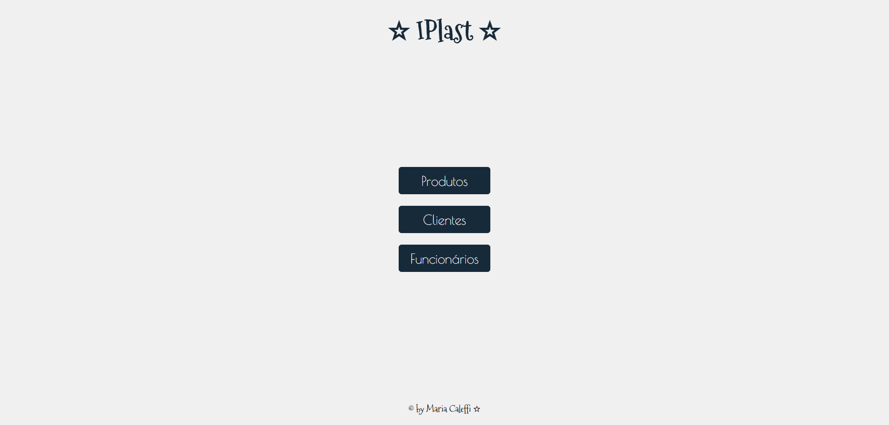
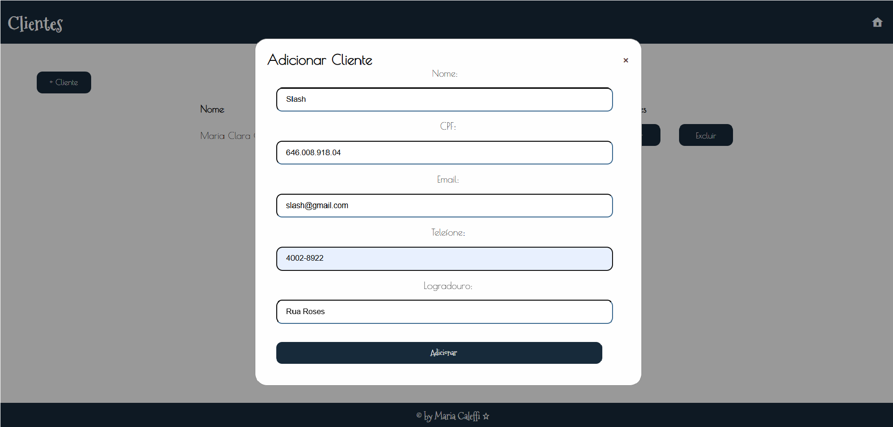
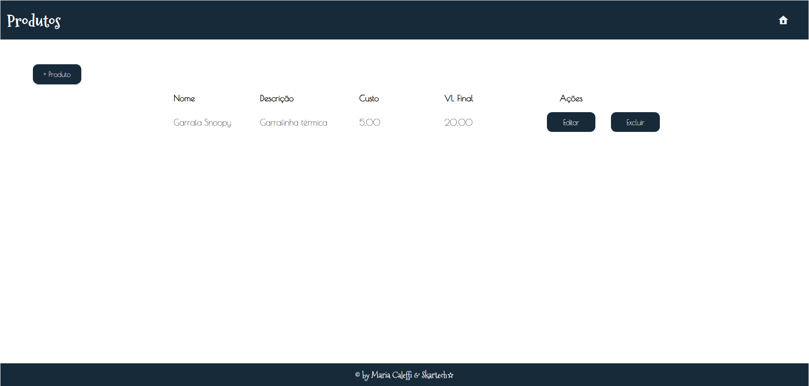
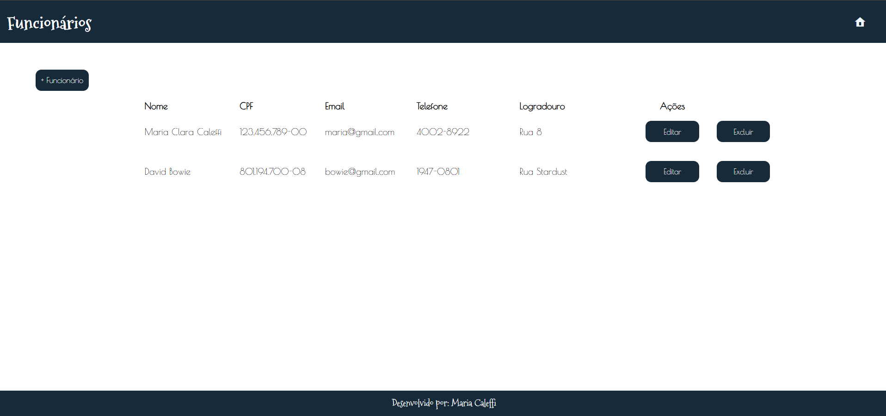

# Avaliação Prática Somativa Front-End

### Contextualização do Desafio
Você é desenvolvedor da empresa SKARTECH, e rescentemente se deparou com uma nova demanda, que sera realizada para uma industria, do ramo de Plásticos na cidade de Pedreira, chamada IPlast, a mesma necessita de um sistema para gerenciamento dos seus: produtos (estoque), funcionários e clientes.

### Desafio (Somente o visual da aplicação):
Fazendo o uso dos seus conhecimentos, utilize as linguagens que aprendeu durante o curso para criar uma aplicação que faça o todo o gerenciamento de "produtos (estoque), funcionários clientes".

#### Página Inicial

#### Exemplo de Modal - Clientes

#### Página de Produtos

#### Página de Funcionários

##### Feito por Maria Clara P. Caleffi ☆